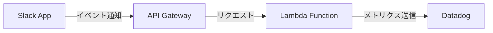

# Hackathon25 Lambda Function

Slackのメッセージからプラスポイントを抽出し、Datadogにメトリクスとして送信するAWS Lambda関数です。

## 機能

- Slackのメッセージから`<@ユーザーID> +数字`の形式を検出
- プラスポイントをDatadogにメトリクスとして送信
- 送信者、受信者、チャンネル情報をタグとして付与

## 環境変数の設定

このプロジェクトでは、機密情報（トークン類）を環境変数として管理しています。

### Lambda環境変数の設定

AWS Lambdaの環境変数として以下を設定してください：

```env
# Slack Configuration
SLACK_BOT_TOKEN=your_slack_bot_token_here

# Datadog Configuration
DD_API_KEY=your_datadog_api_key_here
DD_SITE=datadoghq.com

# Application Configuration
MAX_PLUS_POINTS=10
```

### 環境変数の説明

- `SLACK_BOT_TOKEN`: Slack Bot Token（Slack APIとの通信に使用）
- `DD_API_KEY`: Datadog API Key（メトリクス送信に使用）
- `DD_SITE`: Datadogのサイト（デフォルト: datadoghq.com）
- `MAX_PLUS_POINTS`: 最大プラスポイント数（デフォルト: 10）

## デプロイ

1. 依存関係をインストール:
   ```bash
   pip install -r requirements.txt
   ```

2. Lambda関数にデプロイ:
   ```bash
   # deployment.zipを作成してLambdaにアップロード
   ```

## 注意事項

- トークン類は機密情報のため、適切に管理してください
- Lambda環境変数として設定することで、コードにハードコードされることを防げます
- 最大プラスポイント数（`MAX_PLUS_POINTS`）を超える値は自動的に調整されます 

## アーキテクチャ

このアプリケーションは以下のコンポーネントで構成されています：



### Slack App設定

Slack Appは以下の設定で構成されています：

- Bot Token Scopes:
  - `app_mentions:read`: メンションの読み取り
  - `channels:history`: チャンネルのメッセージ履歴の読み取り
  - `chat:write`: メッセージの送信
  - `reactions:write`: リアクションの追加

- Event Subscriptions:
  - サブスクライブするボットイベント:
    - `app_mention`: ボットへのメンション
    - `message.channels`: パブリックチャンネルのメッセージ

### 処理フロー

1. Slackでメッセージが投稿される
2. Slack Appがイベントを検知し、API Gatewayに通知
3. API GatewayがLambda関数を起動
4. Lambda関数がメッセージを解析し、プラスポイントを抽出
5. 抽出したポイントをDatadogにメトリクスとして送信

## API Gateway設定

このLambda関数は以下のAPI Gatewayで設定されています：

- API名: RecogniDog-API
- ARN: arn:aws:execute-api:ap-northeast-1:601427279990:2ag6s5a8y8/*/*/RecogniDog
- エンドポイント: https://2ag6s5a8y8.execute-api.ap-northeast-1.amazonaws.com/default/RecogniDog

### 設定詳細
- APIタイプ: HTTP
- 認証: NONE
- CORS: No
- メソッド: ANY
- リソースパス: /RecogniDog
- ステージ: default

## テストデータ

以下のJSONデータを使用してAPIをテストできます：

```json
{
  "token": "test-token",
  "team_id": "T091HNU4YQ5",
  "api_app_id": "A09281JK3JL",
  "event": {
    "type": "message",
    "user": "U0927UQM08G",
    "text": "<@U091HNU5G0M> +5",
    "ts": "1234567890.123456",
    "channel": "C091HNU9V1T",
    "event_ts": "1234567890.123456"
  },
  "type": "event_callback",
  "event_id": "Ev1234567890",
  "event_time": 1234567890
}
``` 